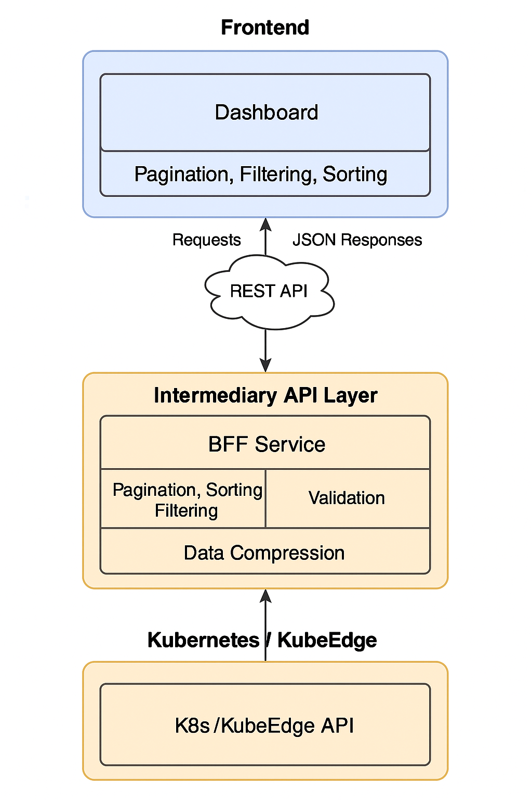

# Dashboard Data Processing Optimization via BFF Layer

| title | status | authors | approvers | creation-date | last-updated |
| ----- | ------ | ------- | --------- | ------------- | ------------ |
| Dashboard Data Processing Optimization via BFF Layer | implementable | @ellie604 | @ghosind @Shelley-BaoYue | 2025-07-06 | 2025-07-06 |

- [Dashboard Data Processing Optimization via BFF Layer](#dashboard-data-processing-optimization-via-bff-layer)
  - [Motivation / Background](#motivation--background)
  - [Use Cases](#use-cases)
  - [Proposal Design](#proposal-design)
    - [1. Backend (Golang BFF Layer)](#1-backend-golang-bff-layer)
    - [2. Frontend Enhancements (React + MUI)](#2-frontend-enhancements-react--mui)
    - [3. Modules and File Mapping](#3-modules-and-file-mapping)
    - [4. Development Scope and Detailed Structure](#4-development-scope-and-detailed-structure)
  - [Design Timeline](#design-timeline)
  - [Architecture Diagram](#architecture-diagram)
  - [Appendix](#appendix)

## Motivation / Background

The KubeEdge Dashboard, in its current form, lacks efficient support for handling large-scale edge resource data. This can lead to slow response times, heavy front-end processing, and poor user experience in production environments.

To address these issues, this proposal introduces a **Backend-for-Frontend (BFF)** architecture to process data at the server-side before forwarding it to the front-end. The key features include pagination, filtering, sorting, field validation, and API structure compression, all implemented within a Golang-based BFF layer.

## Use Cases

- Real-time pagination and filtering for thousands of edge nodes or pods.
- Significant reduction in network transmission size due to structure compression.
- Simplified and decoupled front-end logic.
- Increased system robustness with input validation.
- Improved API response time in large-scale deployment scenarios.

## Proposal Design

### 1. Backend (Golang BFF Layer)
- Based on [PR #50](https://github.com/kubeedge/dashboard/pull/50).
- Add pagination (`?page=2&limit=20`), filtering (`?status=Running`), and sorting (`?sort=name`) logic.
- Use Golang struct validation to check POST/PUT payloads.
- Compress raw Kubernetes API responses before returning JSON.

### 2. Frontend Enhancements (React + MUI)
- Enhance UI for EdgeNodes, Pods, etc., with pagination and filtering controls.
- Refactor `CustomTable.tsx` to support flexible props for UI control.
- Implement debounced network requests and local caching in `request.ts`.

### 3. Modules and File Mapping

The following table maps the development modules to specific files and their descriptions:

| Module | Files | Description |
| ------ | ----- | ----------- |
| Data Handler | `pkg/handlers/resources.go` | Pagination, filtering, sorting, compression, validation |
| API Integration | `src/services/edgeNodes.ts` | Connect BFF API to frontend |
| Table UI | `src/components/CustomTable.tsx` | Add props for pagination and filtering |
| Page Views | `src/views/Pods/index.tsx`, `src/views/EdgeNodes/index.tsx` | Display data using enhanced table |
| Network Utils | `src/utils/request.ts` | Add debounce, caching, error handling |

### 4. Development Scope and Detailed Structure

#### A. Backend API Enhancements (`modules/api/`)

- `modules/api/pkg/handler/`
  - `pagination.go`: Pagination logic
  - `filtering.go`: Filtering logic
  - `sorting.go`: Sorting logic
  - `cache.go`: Caching mechanism

- `modules/api/pkg/resource/`
  - `deployment_enhanced.go`: Enhanced deployment API
  - `node_enhanced.go`: Enhanced node API
  - `pagination_helper.go`: Pagination utility helpers

#### B. Frontend UI Components (`src/`)

- `src/components/DataTable/`
  - `index.tsx`: Enhanced table component
  - `Pagination.tsx`: Pagination control component
  - `Filters.tsx`: Filtering control component
  - `Sorting.tsx`: Sorting control component

- `src/hooks/`
  - `useTableQuery.ts`: Unified query hook for tables
  - `usePagination.ts`: Hook to manage pagination state
  - `useFiltering.ts`: Hook to manage filter state

- `src/app/deployment/page.tsx`: Updated deployment resource page
- `src/app/node/page.tsx`: Updated node resource page

## Design Timeline

The implementation will follow this timeline structure:

| Phase | Week | Time Range | Key Task |
| ----- | ---- | ---------- | -------- |
| Requirement Review & Setup | Week 1 | Jul 1 – Jul 5 | Study architecture, define task scope |
| Backend Data Module | Week 2–4 | Jul 6 – Jul 26 | Add pagination/filter/sort/compression |
| Frontend Components | Week 5–6 | Jul 27 – Aug 9 | Build UI controls, link to backend |
| Validation Logic | Week 7 | Aug 10 – Aug 16 | Backend field validation |
| Request Optimization | Week 8 | Aug 17 – Aug 23 | Cache, debounce, error handling |
| Testing & Patches | Week 9–10 | Aug 24 – Sep 6 | Write tests, polish UX |
| Documentation & PR | Week 11–13 | Sep 7 – Sep 30 | Write doc, submit PR, respond to feedback |

## Architecture Diagram

## Appendix

- Technologies: Golang + Gin, Kubernetes Client-go, React + MUI, REST + JSON
- Scope: Dashboard usability, backend efficiency, system resilience.

